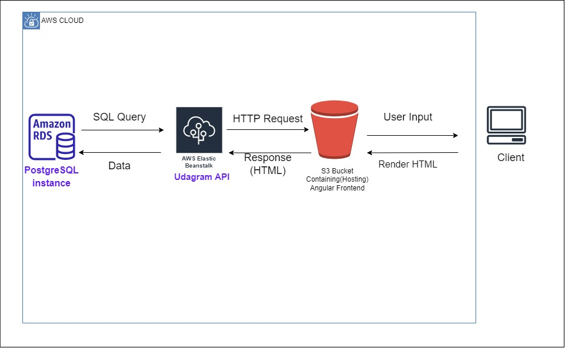

# Infrastructure

Udagram is a fullstack application: udagram-frontend and udagram-api.
udagram-frontend is an Angular/Ionic application hosted in an S3 bucket by Amazon Web Services.
udagram-api is an Express/NodeJs application hosted by an Elastic Beanstalk environment by Amazon Web Services.
PostgreSQL database hosted by RDS service by Amazon Web Services.



## AWS Cloud Setup

### RDS Postgres

The application server uses AWS RDS Postgres as a database for storing and retrieving information.

- RDS - Database Host: mydb.crkfsuo6dghd.us-east-1.rds.amazonaws.com
- RDS - Database Port: 5432
- RDS - Database Name: mydb

### S3 Bucket

The frontend application is deployed using AWS S3 Bucket. The bundled assets are uploaded to an S3 bucket and that
the bucket is made publicly readable.

- S3 Endpoint - Frontend: <http://abbas-udagram-bucket.s3-website-us-east-1.amazonaws.com/>

End-users can access the application from the Bucket URL.

### Elastic Beanstalk

The application server is deployed on the AWS Elastic Beanstalk service. The application is built, archived, and uploaded
to and S3 bucket from where Elastic Beanstalk extracts and runs the application on an endpoint.

- Elastic Beanstalk URL - Backend: <http://udagram-api2-dev2.eba-penyj7nk.us-east-1.elasticbeanstalk.com/>

# Environment Variables

Setup the following variables in the .env file or in the cloud environments:

```text
PORT=8080
POSTGRES_HOST={Database_IP_Address}
POSTGRES_PORT={Database_Port}
POSTGRES_DB={Database_Name}
POSTGRES_USERNAME={Database_Username}
POSTGRES_PASSWORD={Database_Password}
URL={Url}
JWT_SECRET={Any_PassPhrase}
AWS_REGION={us-east-1}
AWS_PROFILE={Profile}
AWS_BUCKET={Bucket_Name}
```
